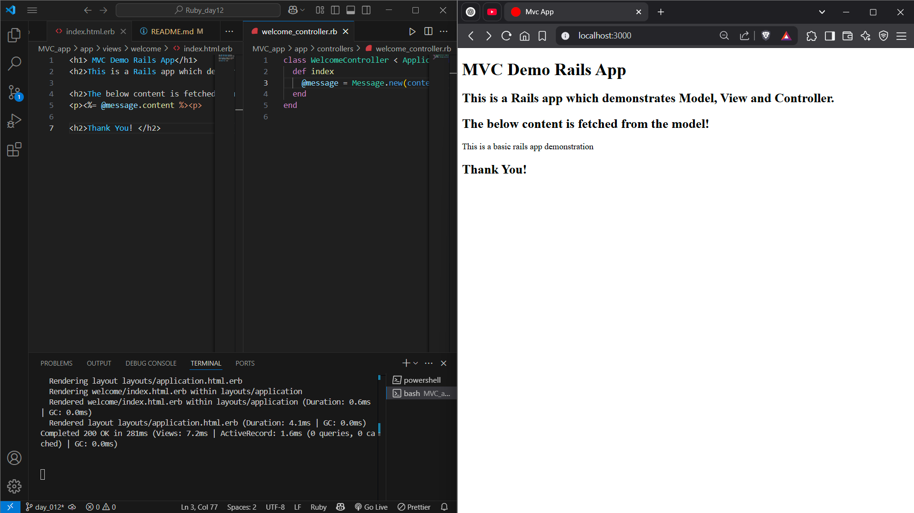

# Ruby_day12

#  MVC Demo App (Rails)

This is a simple Ruby on Rails application demonstrating the **MVC architecture** as part of Day 12 of my Ruby Bootcamp. The app uses Rails to create a basic Model, View, and Controller setup to render a custom message.

---

##  What This App Does

- Sets up a basic Rails app
- Implements a simple **Message model**
- Uses a **Welcome controller** to handle requests
- Displays a message using an **index view**

---

##  Concepts Covered

- **MVC Architecture in Rails**
  - **Model:** Contains data logic (here, a simple `Message` with a `content` attribute)
  - **View:** Displays data passed by the controller
  - **Controller:** Manages app flow, connects models to views

---

##  File Structure

mvc_demo_app/
├── app/
│ ├── controllers/
│ │ └── welcome_controller.rb
│ ├── models/
│ │ └── message.rb
│ └── views/
│ └── welcome/
│ └── index.html.erb
├── config/
│ └── routes.rb
├── db/
│ └── migrate/
└── README.md

##  Output Screenshot

